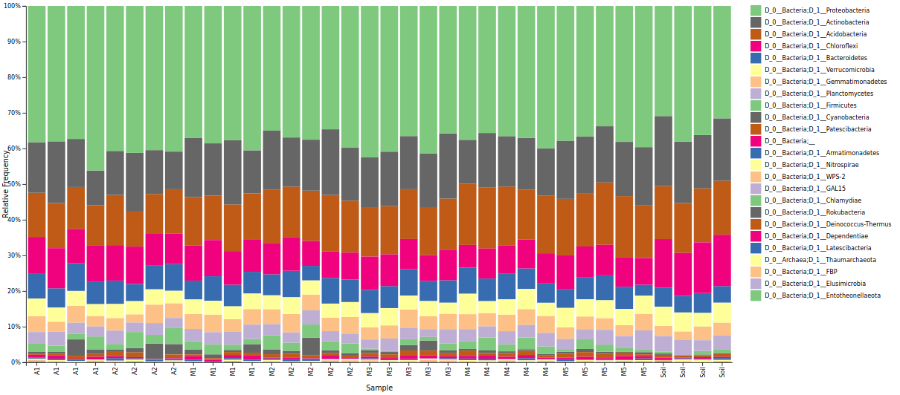
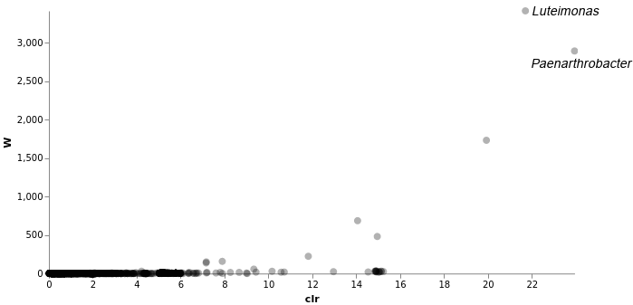
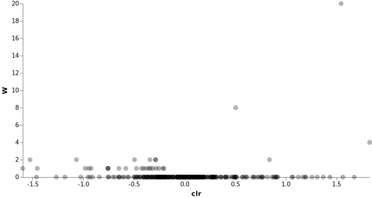

# Bitácora trabajo datos espermosfera

## 2020-03-04 Árbol filogenético a partir de clasificación taxonómica

Usando el archivo **table-dada2.qza** y el archivo **taxonomy.qza** arrojado por el clasificador de Qiime usando como datos de entrenamiento secuencias de Silva se ejecutó el siguiente comando:

```bash
qiime taxa collapse \
      --i-table table-dada2.qza \
      --i-taxonomy taxonomy.qza \
      --p-level 6 \ # or whatever level of taxonomy you want
      --output-dir taxtable/
```

Esto estaba en esta página: https://forum.qiime2.org/t/how-to-make-classic-otu-table-with-qiime2/3612/3

En el directorio output "taxtable/" quedó un archivo llamado "collapsed-table.qza", este archivo fue descomprimido y luego el archivo **feature-table.biom** allí contenido fue convertido en un archivo .tsv usando el siguiente comando:

`(qiime2-2019.10) nesper@gojira-E402MA:~/Documentos/genomeseq/taxonomy-spermosphere/phylogenetic-tree/taxtable$ biom convert -i 8f17f216-8ae0-43ba-a691-fbb0428afc4d/data/feature-table.biom -o feature-table-taxonomy.tsv --to-tsv`


También se hizo un barplot de los taxones encontrados en la clasficación mediante el siguiente comando:

```bash
qiime taxa barplot \
  --i-table table-dada2.qza \
  --i-taxonomy taxonomy.qza \
  --m-metadata-file metadatos.tsv \
  --o-visualization taxa-bar-plots.qzv
```
  
Esto se hizo siguiendo las instrucciones de este enlace: https://chmi-sops.github.io/mydoc_qiime2.html#step-9-assign-taxonomy

La siguiente es la ruta absoluta del archivo "metadatos.tsv" original:  
`/home/nesper/Documentos/maestría/maestría-sistemas-dinámicos/2019-2/semillero-bioinformatica/data/metadatos.tsv`

El archivo de salida fue visualizado con el comando:
`qiime tools view taxa-bar-plots.qzv`



**Fig 1.** Taxonomical bar graphs showing the phyla of bacteria found in the different samples. Colors are presented from the top to the bottom of the graph (A: Ancestral, M: Modern, Soil: Uncultured soil).

## 2020-03-06 Árbol filogenético

Después de alinear las secuencias de espermosfera, se hizo el proceso de masking para eliminar posiciones no informativas del alineamiento y así hacer más eficientemente la filogenia. Se usó el siguiente comando en el cluster de BIOS:

```bash
qiime alignment mask \
  --i-alignment aligned-rep-seqs-spe.qza \
  --o-masked-alignment masked-aligned-rep-seqs-spermosphere.qza
```

Posteriormente se realizó la inferencia filogenética:

```bash
qiime phylogeny fasttree \
  --i-alignment masked-aligned-rep-seqs-spermosphere.qza \
  --o-tree fasttree-tree-spermosphere.qza
```
  
### Fasttree to Newick

Para convertir el árbol filogenético generado al alinear las secuencias en Qiime2 mediante mafft y luego usar fasttree, se usó el siguiente comando:

```bash
qiime tools export --input-path fasttree-tree-spermosphere.qza --output-path newick-tree-spe
```

En la carpeta "newick-tree-spe" quedó el archivo "tree.nwk" con la información del árbol filogenético.

**De ahora en adelante usaré la abreviación _spe_ para denotar los archivos relacionados con los datos de espermosfera.**

## Árbol iTOL

El árbol filogenético generado mediante fasttree fue subido a iTOL y luego se subió a este árbol la clasificación taxonómica correspondiente.

También se subió el _table-dada2.qza_ con la información de las abundancias de cada muestra.

## 2020-03-25 Análisis de composición (ANCOM)

También estoy analizando la composición para saber qué ASVs están en diferentes abundancias en las diferentes muestras, se corrieron los siguientes comandos:

```bash
(qiime2-2019.10) jeperezj@r1masterl01:~/jcar/spermosphere/ancom-composition-analysis$ qiime composition add-pseudocount \
  --i-table table-dada2.qza \
  --o-composition-table comp-table-spe.qza
  
(base) jeperezj@r1masterl01:~/jcar/rhizosphere/ancom-composition-analysis$ qiime composition ancom \
    --i-table comp-table-spe.qza \
    --m-metadata-file metadatos.tsv \
    --m-metadata-column Plant_status \
    --o-visualization ancom-plant-status-spe.qzv
```

Este último archivo fue transferido a mi laptop:

```bash
(base) nesper@gojira-E402MA:~/Documentos/genomeseq/vpnbios-jeperezj$ scp jeperezj@door1vpn.bios.co:~/jcar/spermosphere/ancom-composition-analysis/ancom-plant-status-spe.qzv ../spermosphere/ancom-composition-analysis/
```

Esta es la visualización:



**Fig 2.** ANCOM Volcano plot.

Estas son las entidades taxonómicas que tenían una abundancia diferente entre las muestras:

D_0__Bacteria;D_1__Actinobacteria;D_2__Actinobacteria;D_3__Micrococcales;D_4__Micrococcaceae;D_5__Paenarthrobacter (0.94648)
D_0__Bacteria;D_1__Proteobacteria;D_2__Gammaproteobacteria;D_3__Xanthomonadales;D_4__Xanthomonadaceae;D_5__Luteimonas (0.73401)

## ANCOM solo con suelo cultivado

Como esperamos que entre el suelo no cultivado y el cultivado cambie más las entidades taxonómicas, es mejor crear un set de datos solamente con el suelo cultivado y comparar Modern y Ancestral:

```bash
(qiime2-2019.10) jeperezj@r1masterl01:~/jcar/spermosphere$ qiime feature-table filter-samples \
    --i-table table-dada2.qza \
    --m-metadata-file metadatos.tsv \
    --p-where "[Plant_status]!='Soil'" \
    --o-filtered-table cultured-soil-table-spe.qza

(qiime2-2019.10) jeperezj@r1masterl01:~/jcar/spermosphere/ancom-composition-analysis/only-cultured-soil-ancom$ qiime composition add-pseudocount \
    --i-table ../../cultured-soil-table-spe.qza \
    --o-composition-table comp-table-cultured-spe.qza

(qiime2-2019.10) jeperezj@r1masterl01:~/jcar/spermosphere/ancom-composition-analysis/only-cultured-soil-ancom$ time qiime composition ancom \
    --i-table comp-table-cultured-spe.qza  \
    --m-metadata-file ../metadatos.tsv  \
    --m-metadata-column Plant_status  \
    --o-visualization ancom-plant-status-cultured-spe.qzv
```

### ANCOM agrupando por familia

También se agruparon los ASVs por familia y se realizó el análisis ANCOM solo para el suelo cultivado a nivel de familia:
```bash
(qiime2-2019.10) jeperezj@r1masterl01:~/jcar/spermosphere/ancom-composition-analysis/collapsed-to-family$ qiime taxa collapse \
    --i-table cultured-soil-table-spe.qza \
    --i-taxonomy taxonomy.qza \
    --o-collapsed-table table-family-level-spe.qza \
    --p-level 5
    
(qiime2-2019.10) jeperezj@r1masterl01:~/jcar/spermosphere/ancom-composition-analysis/collapsed-to-family$ qiime composition add-pseudocount \
    --i-table table-family-level-spe.qza \
    --o-composition-table comp-table-famlvl-spe.qza

(qiime2-2019.10) jeperezj@r1masterl01:~/jcar/spermosphere/ancom-composition-analysis/collapsed-to-family$ time qiime composition ancom \
    --i-table comp-table-famlvl-spe.qza \
    --m-metadata-file metadatos.tsv \
    --m-metadata-column Plant_status \
    --o-visualization ancom-famlvl-cult-spe.qzv
```
**Nota:** ¡Este análisis solo se demoró 22 segundos! Los ANCOM anteriores se demoraron más de 15 horas.

El resultado de este último ANCOM fue "No significant features found". Abajo se adjunta el gráfico:



# 2020-04-01 Reunión Meet

Por hacer:
- Ayudarle a Estefa con análisis de abundancia diferencial en R con el paquete MetagenomeSeq.
- Seguir con el ANCOM.
- Leer paper ANCOM.
- Seguir con el árbol filogenético en iTOL.

# 2020-04-05 Gneiss composition analysis

Haremos un análisis de composición con Gneiss para compararlo con los resultados del ANCOM. Para eso seguimos [este tutorial](https://docs.qiime2.org/2020.2/tutorials/gneiss/).

```bash
(qiime2-2019.10) jeperezj@r1masterl01:~/jcar/spermosphere/gneiss-composition-analysis$ qiime gneiss correlation-clustering \
    --i-table ../table-dada2.qza \
    --o-clustering hierarchy-spe.qza
    
qiime gneiss dendrogram-heatmap \
  --i-table table-dada2.qza \
  --i-tree hierarchy-spe.qza \
  --m-metadata-file metadatos.tsv \
  --m-metadata-column Plant_status \
  --p-color-map seismic \
  --o-visualization heatmap-spe.qzv

```

# Dudas para reunión 2020-04-07
En el material suplementario del paper de ANCOM ([Mandal et al., 2015](https://www.tandfonline.com/doi/full/10.3402/mehd.v26.27663)) decía:
> As commonly done [5], we restricted the analysis to taxa that are present in at least 25%
of the samples. This is done because low frequency OTUs are often thought to be difficult to interpret statistically.

La pregunta es ¿hacemos lo mismo con nuestros datos?
